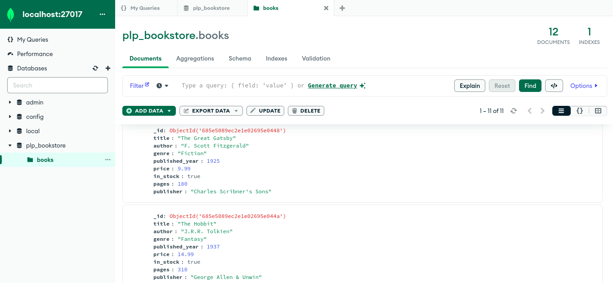

# 📚 MongoDB Fundamentals Assignment

This project demonstrates the use of MongoDB's core features including data insertion, basic queries, advanced filters, indexing, and aggregation pipelines using the official MongoDB Node.js driver.

---

## 📁 Project Structure
├── insert_books.js # Script to insert dummy book data into the database
├── queries.js # Script to run various MongoDB queries and aggregations
├── package.json # Project metadata and dependencies
└── README.md # Instructions and documentation
--- how_to_run.md # Instructions on how to run the project


---

## 🚀 Getting Started

### 📦 Prerequisites

- Node.js (v18+ recommended)
- MongoDB (local or remote instance)

Ensure MongoDB is running on `mongodb://localhost:27017`, or update the URI in the script files.

---

### 🛠️ Installation

1. Clone the repository:
   ```bash
   git clone https://github.com/PLP-MERN-Stack-Development/week-1-mongodb-fundamentals-assignment-GJablo.git
   cd week-1-mongodb-fundamentals-assignment-GJablo
  ```
2. Install dependencies:
```bash
npm install
```
- Before executing any queries, populate the database with sample book data by running:
```bash
node insert_books.js
```
- After loading data explore different types of mongodb queries by running:
```bash
node queries.js
```

## 📸 Sample Output of Database

Here’s a preview of the output of the database:


